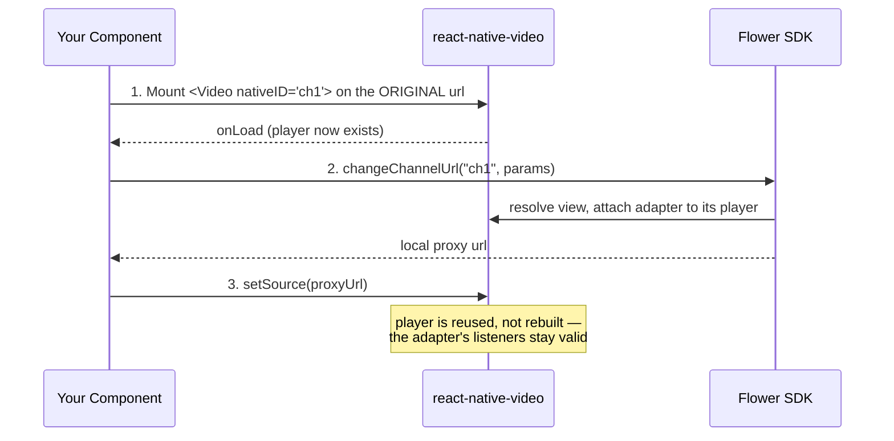

# How the Integration Works

Unlike the other platforms, the React Native package has no `FlowerAdView` for you to place and no player wrapper class to adopt. The ad overlay is created and mounted by the SDK itself, over the `<Video>` element you point it at. Two ideas carry the whole integration: **addressing by `nativeID`**, and the **two-phase player handover**.

## Addressing by `nativeID`

Every SDK call takes a `nativeId` string as its first argument. That string is the `nativeID` prop of the `<Video>` element the session belongs to.

```tsx
<Video nativeID="channel-1" source={{uri: streamUrl}} />
```

```tsx
await changeChannelUrl('channel-1', {videoUrl: streamUrl, adTagUrl, channelId});
```

The SDK resolves that view, mounts its ad overlay on it, and keys all of its state by the id. Every ad event carries the same `nativeId` back, which is what lets several players coexist on one screen.

:::note Why not a ref?
`react-native-video`'s ref is an imperative handle (`seek`, `pause`, …), so `findNodeHandle()` cannot resolve it. Walking down from a wrapping `<View>` does not work either — under the new architecture the video view is not mounted as a descendant of the element that wraps it. `nativeID` is the only addressing that stays unambiguous.
:::

:::caution
Each `nativeID` on screen must be unique. Reusing one across two mounted `<Video>` elements makes the resolution ambiguous.
:::

## The Two-Phase Handover (Linear TV and VOD)

The SDK is not a call-and-forget API: it needs the **real player instance** so it can attach an adapter and follow playback. `react-native-video` builds and owns that player internally and never exposes it, and it only constructs one once a source has been set. So the flow is deliberately two-phase:



1. Mount `<Video nativeID="…">` on the **original** stream URL. That is what makes `react-native-video` construct its player.
2. Call `changeChannelUrl()` (or `requestVodAd()`) once the player exists — waiting for `onLoad` is the reliable signal. The SDK resolves the view, attaches itself to the player, and returns the local proxy URL.
3. Swap the `<Video>` source to the returned proxy URL.

:::info
Step 3 does **not** rebuild the player. `react-native-video` only constructs one when its player field is null and otherwise reuses it, which is what keeps the adapter's listeners — attached once at handover — valid.
:::

Calling before the player exists rejects with a message saying so:

```plain
react-native-video has not created its ExoPlayer yet.
Mount <Video> on the original URL and wait for onLoad before calling this.
```

That is the Android wording. iOS sends the same sentence with `AVPlayer` in place of `ExoPlayer`, since that is the player `react-native-video` builds there.

## Who Starts a Break

Who triggers ad playback differs by content type. This is the SDK's model rather than something specific to React Native:

| Content type | Requested with | Who starts the break |
| ---| ---| --- |
| Linear TV / FAST | `changeChannelUrl()` | The SDK — the break is scheduled by the cue in the stream and plays itself |
| VOD | `requestVodAd()` | Your app — the break is prepared and then waits for `play()` |
| Inline / Interstitial | `requestAd()` | Your app — the break is prepared and then waits for `play()` |

For VOD and inline breaks, the `prepare` event is where you pause your content and call `play()`, and `completed` is where you resume. See [Ad Events](../api/ad-event.md).

## URL Rewriting vs. Overlay Playback

| Content type | Content URL | Where ads play |
| ---| ---| --- |
| Linear TV / FAST | Rewritten to a local proxy URL | Spliced into the stream, plus the SDK's ad player for Google/IMA ads |
| VOD | **Not** rewritten — the content keeps playing from its own URL | The SDK's own ad player in the overlay |
| Inline / Interstitial | Not involved | The SDK's own ad player in the overlay |

## Error Handling

All SDK functions return promises.

| Function | On an unknown or unstarted `nativeId` |
| ---| --- |
| `changeChannelUrl`, `requestVodAd`, `requestAd` | Rejects — no view with that `nativeID`, or its player does not exist yet |
| `play`, `notifyContentEnded` | Rejects — no channel, VOD or inline request was started for that id |
| `stop`, `release` | Resolves silently, so teardown paths can call them without tracking session state |

Runtime ad errors do not reject a promise. They arrive as an `error` ad event instead — see [Ad Events](../api/ad-event.md).
