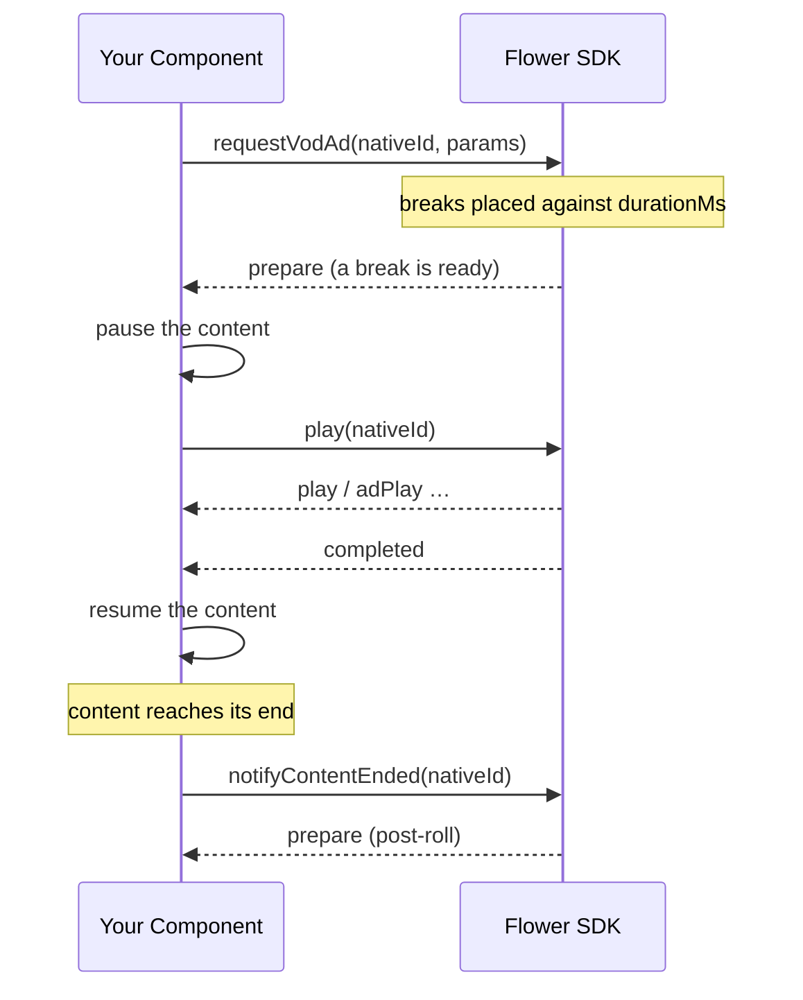

# VOD Ad Implementation

VOD ads are requested with `requestVodAd()`. Nothing is rewritten here — the content keeps playing from its own URL, and each break arrives as a `prepare` event on the SDK's own ad player, layered over your `<Video>`.

Because the content player stays yours, **pausing and resuming it around each break is your app's responsibility**.

## The Break Lifecycle



## Implementation

```tsx
import React, {useCallback, useEffect, useRef, useState} from 'react';
import {StyleSheet, View} from 'react-native';
import Video from 'react-native-video';
import {
  addAdEventListenerFor,
  notifyContentEnded,
  play,
  release,
  requestVodAd,
} from '@anypoint/flower-sdk-react-native';

type Props = {
  nativeId: string;
  contentUrl: string;
  adTagUrl: string;
  contentId: string;
  durationMs: number;
};

export function VodPlayer({
  nativeId,
  contentUrl,
  adTagUrl,
  contentId,
  durationMs,
}: Props) {
  const [paused, setPaused] = useState(false);
  const requested = useRef(false);

  useEffect(() => {
    const subscription = addAdEventListenerFor(nativeId, event => {
      if (event.event === 'prepare') {
        // Pausing and resuming the content around the break is the app's job.
        setPaused(true);
        play(nativeId).catch(e => console.error(`play failed: ${e.message}`));
      } else if (event.event === 'completed') {
        setPaused(false);
      } else if (event.event === 'error') {
        // Do not strand the viewer on a frozen frame when a break fails.
        setPaused(false);
        console.error(`ad error: ${event.message}`);
      }
    });
    return () => subscription.remove();
  }, [nativeId]);

  useEffect(
    () => () => {
      if (requested.current) {
        release(nativeId).catch(() => {});
      }
    },
    [nativeId],
  );

  // The player must exist before requesting, so this runs from onLoad.
  const request = useCallback(async () => {
    if (requested.current) {
      return;
    }
    try {
      await requestVodAd(nativeId, {adTagUrl, contentId, durationMs});
      requested.current = true;
    } catch (error: any) {
      console.error(`requestVodAd failed: ${error.message}`);
    }
  }, [nativeId, adTagUrl, contentId, durationMs]);

  return (
    <View style={styles.player}>
      <Video
        nativeID={nativeId}
        // The content url is never rewritten for VOD.
        source={{uri: contentUrl}}
        style={StyleSheet.absoluteFill}
        resizeMode="contain"
        paused={paused}
        onLoad={request}
        // Without this the SDK never learns the content is over, and no post-roll can run.
        onEnd={() =>
          notifyContentEnded(nativeId).catch(e =>
            console.error(`notifyContentEnded failed: ${e.message}`),
          )
        }
        onError={e => console.error(`player error: ${JSON.stringify(e)}`)}
      />
    </View>
  );
}

const styles = StyleSheet.create({
  player: {width: '100%', aspectRatio: 16 / 9, backgroundColor: '#000'},
});
```

:::caution
`requestVodAd()` needs the player to exist, exactly like `changeChannelUrl()` — call it after `onLoad`, not while mounting. Unlike the linear case there is no source swap afterwards, so `onLoad` fires only once and no re-entry guard would be strictly necessary; the ref above simply keeps the component safe against remounts.
:::

## Pre-roll, Mid-roll and Post-roll

The break positions come from the ad response, placed against the `durationMs` you supply — so the value must be the real total duration of the content, in milliseconds.

| Break | Trigger |
| ---| --- |
| Pre-roll | A `prepare` event shortly after `requestVodAd()` resolves |
| Mid-roll | A `prepare` event when playback reaches the break position |
| Post-roll | A `prepare` event after you call `notifyContentEnded()` |

:::caution
A post-roll cannot run unless the app calls `notifyContentEnded(nativeId)`. Wire it to the `<Video>` component's `onEnd` prop.
:::

## Targeting and Headers

```tsx
await requestVodAd(nativeId, {
  adTagUrl,
  contentId,
  durationMs,
  extraParams: {title: 'My Summer Vacation', genre: 'horror'},
  adTagHeaders: {'custom-ad-header': 'custom-ad-header-value'},
});
```

See [Define extraParams](../define-extra-params.md) and the [`requestVodAd` API reference](../../api/vod.md).

## Related

*   [`requestVodAd` API reference](../../api/vod.md)
*   [Ad Events](../../api/ad-event.md)
*   [How the Integration Works](../how-the-integration-works.md)
