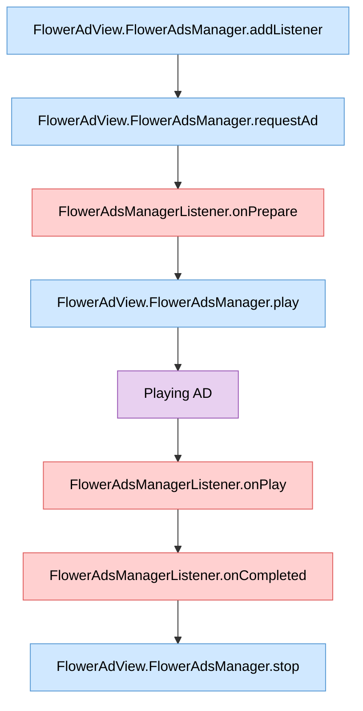

# Advanced Ad Formats

This SDK enables you to insert ads anywhere — on main pages, between screen transitions, between posts, and more.

## Ad Types

### Inline Ads
Ads placed naturally within the content flow of a webpage or app — such as between feed items, inside article bodies, or among list entries. They blend into the user experience while maintaining visibility.

### Masthead Ads
Premium ads displayed prominently at the top of a page (header area). They offer high visibility and are commonly used on portal home pages or app home screens to maximize brand awareness.

### Interstitial Ads
Full-screen ads shown at natural transition points — such as screen transitions, level changes, or between content items. They provide high engagement; the user returns to the original content after dismissing the ad or after a set duration.

## Other

You can insert any type of ad at any position or timing. Contact your account manager for details.

## Lifecycle

### Insert Interstitial Ads

A flowchart showing the entire process — from registering an ad event listener to inserting ads.

> **Legend**  
>  &nbsp;Function call made by you
> &nbsp;Event fired by SDK
