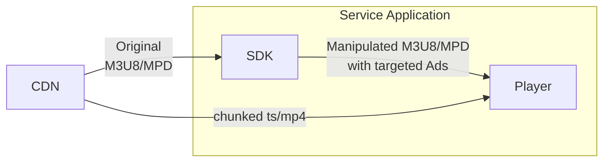
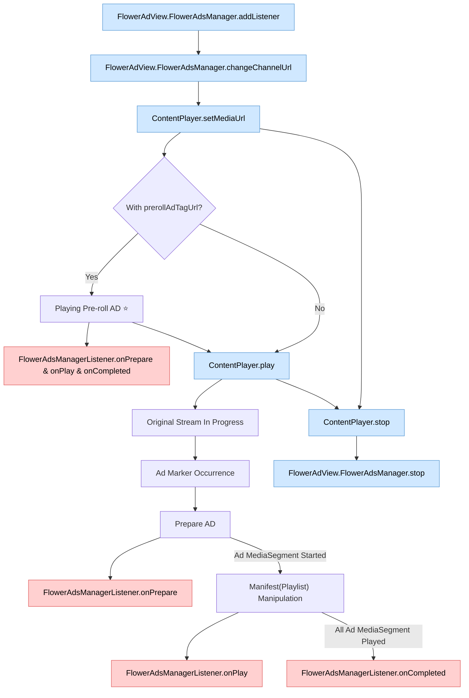

# OTT Linear TV (incl. FAST) Ads

This SDK allows you to play ads when a viewer enters live HLS/DASH content, or insert replacement ads by processing the playlist manifest (m3u8 or mpd) using ad markers.

## Ad Types

### Main Stream Replacement Ads

This ad type replaces the main content stream using ad markers (e.g., SCTE-35). When a replacement ad plays or finishes, the SDK sends events to the host service.

### Channel Entry Ads

These ads play before a viewer enters the main content stream. When a viewer requests to watch live content, they will first see the entry ad. Once the entry ad finishes, the viewer will seamlessly transition to the main content stream.
Note that when using channel entry ads, the app does not need to start playback manually, as the main content stream starts automatically after the entry ad finishes. Starting playback manually may briefly expose the main content video, degrading the UX.

## View Layer Arrangement

The _AdView_ must be the same size as the view in which the main player is placed and overlap that view completely.

_AdView_ is displayed transparently by default, and "Show more" or "Skip" buttons or overlay advertisements can be displayed on it if needed.

## Application Architecture

The player uses the media stream URL provided through the SDK. The SDK manipulates the manifest (m3u8/mpd) or routes segments to replace main content with ads, so no special player-side configuration is needed.

## Lifecycle

A flowchart showing the entire process of registering an ad event listener and replacing ads while playing the main content.

> **Legend**  
>  &nbsp;Function call made by you
> &nbsp;Event fired by SDK
> ⭐ Optional
