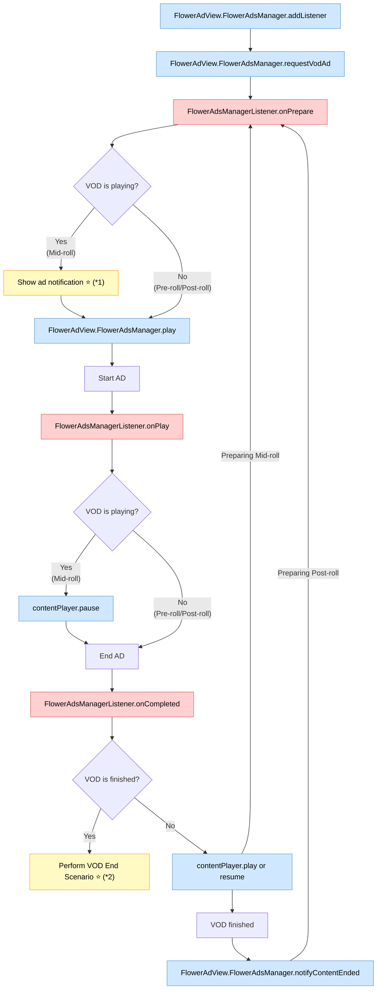

# VOD Ads

This SDK enables you to insert ads during VOD content playback according to your application's ad policy.

## Ad Types

Three types of ads can be inserted into VOD content:

- **Pre-roll ads**: Commercials played before the video content starts.
- **Mid-roll ads**: Commercials played during the video stream.
- **Post-roll ads**: Commercials played at the end of the video stream.

FLOWER manages the ad policies for each type and delivers them to the SDK in VMAP format. Contact your account manager for details.

## View Layer Arrangement

The _AdView_ must be the same size as the view in which the main player is placed and overlap that view completely.

_AdView_ is displayed transparently by default, and "Show more" or "Skip" buttons or overlay advertisements can be displayed on it if needed.

## Lifecycle

A flowchart showing the entire process — from registering an ad event listener to coordinating ad playback with the main content.

> **Legend**  
>  &nbsp;Function call made by you
> &nbsp;Event fired by SDK
> ⭐ Optional

> (\*1) Show ad notification
> - To enhance the user experience, you can display an ad notification before a mid-roll ad plays in accordance with your service policy.
> - e.g. An ad will start in 5 seconds.

> (\*2) Perform VOD end scenario
> - This SDK provides a way to handle specific scenarios at the end of VOD playback, after any post-roll ads have finished. This allows you to implement custom actions or transitions based on your service's requirements.
> - e.g. Automatically start the next episode in a series.
