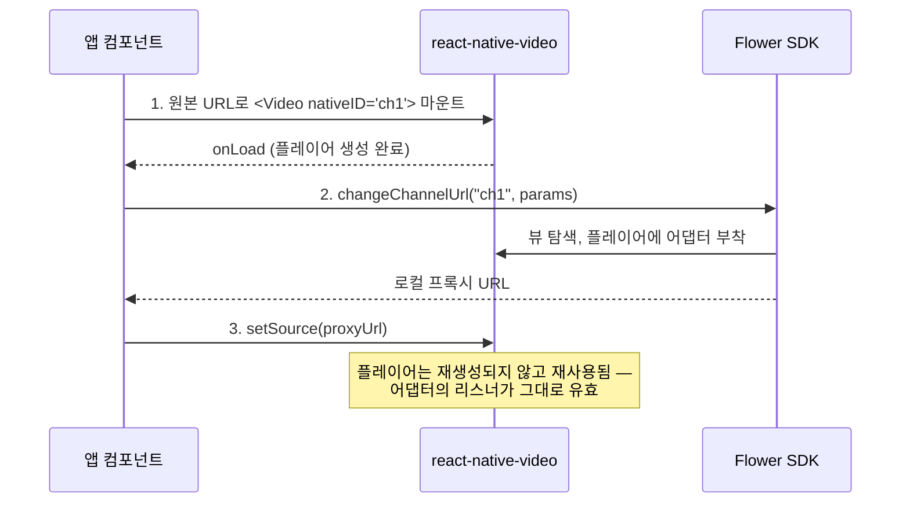

# 연동 동작 방식

다른 플랫폼과 달리 React Native 패키지에는 앱이 직접 배치해야 하는 `FlowerAdView`도, 채택해야 하는 플레이어 래퍼 클래스도 없습니다. 광고 오버레이는 SDK가 직접 생성해서, 지정한 `<Video>` 위에 마운트합니다. 연동 전체를 관통하는 개념은 두 가지입니다 — **`nativeID`를 통한 주소 지정**과 **2단계 플레이어 인계**입니다.

## `nativeID`를 통한 주소 지정

모든 SDK 호출은 첫 번째 인자로 `nativeId` 문자열을 받습니다. 이 문자열은 해당 세션이 속한 `<Video>` 요소의 `nativeID` prop입니다.

```tsx
<Video nativeID="channel-1" source={{uri: streamUrl}} />
```

```tsx
await changeChannelUrl('channel-1', {videoUrl: streamUrl, adTagUrl, channelId});
```

SDK는 이 뷰를 찾아 광고 오버레이를 마운트하고, 모든 상태를 해당 id를 키로 관리합니다. 모든 광고 이벤트도 같은 `nativeId`를 함께 전달하므로, 한 화면에 여러 플레이어를 둘 수 있습니다.

:::note ref를 사용하지 않는 이유
`react-native-video`의 ref는 명령형 핸들(`seek`, `pause` 등)이므로 `findNodeHandle()`로 해석할 수 없습니다. 감싸는 `<View>`에서 탐색해 내려가는 방법도 통하지 않습니다 — New Architecture에서는 비디오 뷰가 자신을 감싼 요소의 하위 노드로 마운트되지 않기 때문입니다. `nativeID`만이 모호하지 않게 대상을 지정할 수 있는 유일한 방법입니다.
:::

:::caution
화면에 있는 각 `nativeID`는 고유해야 합니다. 마운트된 두 `<Video>` 요소가 같은 값을 사용하면 대상을 특정할 수 없습니다.
:::

## 2단계 인계 (Linear TV 및 VOD)

SDK는 호출만 하고 끝나는 API가 아닙니다. 어댑터를 붙이고 재생을 추적하려면 **실제 플레이어 인스턴스**가 필요합니다. `react-native-video`는 그 플레이어를 내부에서 만들어 소유하며 외부로 노출하지 않고, 소스가 설정된 뒤에야 플레이어를 생성합니다. 그래서 흐름이 의도적으로 2단계로 나뉩니다:



1. **원본** 스트림 URL로 `<Video nativeID="…">`를 마운트합니다. 이것이 `react-native-video`가 플레이어를 생성하게 하는 조건입니다.
2. 플레이어가 생성된 뒤 `changeChannelUrl()`(또는 `requestVodAd()`)을 호출합니다. `onLoad`를 기다리는 것이 확실한 신호입니다. SDK가 뷰를 찾아 플레이어에 자신을 연결하고 로컬 프록시 URL을 반환합니다.
3. `<Video>`의 소스를 반환된 프록시 URL로 교체합니다.

:::info
3단계에서 플레이어는 **재생성되지 않습니다**. `react-native-video`는 플레이어 필드가 null일 때만 새로 만들고 그 외에는 재사용하므로, 인계 시점에 한 번 부착된 어댑터의 리스너가 계속 유효합니다.
:::

플레이어가 만들어지기 전에 호출하면 다음과 같은 메시지로 reject됩니다:

```plain
react-native-video has not created its ExoPlayer yet.
Mount <Video> on the original URL and wait for onLoad before calling this.
```

위는 Android의 문구입니다. iOS는 같은 문장에서 `ExoPlayer` 자리에 `AVPlayer`가 들어갑니다 — 그쪽에서 `react-native-video`가 만드는 플레이어가 `AVPlayer`이기 때문입니다.

## 광고 브레이크를 시작하는 주체

광고 재생을 누가 시작하는지는 콘텐츠 유형에 따라 다릅니다. 이는 React Native 고유의 특성이 아니라 SDK의 모델입니다:

| 콘텐츠 유형 | 요청 함수 | 브레이크 시작 주체 |
| ---| ---| --- |
| Linear TV / FAST | `changeChannelUrl()` | SDK — 스트림의 큐(cue)에 따라 예약되어 자동 재생 |
| VOD | `requestVodAd()` | 앱 — 준비된 뒤 `play()` 호출을 기다림 |
| Inline / Interstitial | `requestAd()` | 앱 — 준비된 뒤 `play()` 호출을 기다림 |

VOD와 인라인 브레이크의 경우 `prepare` 이벤트에서 콘텐츠를 일시정지하고 `play()`를 호출하며, `completed`에서 재개합니다. [광고 이벤트](../api/ad-event.md)를 참고하세요.

## URL 재작성 vs 오버레이 재생

| 콘텐츠 유형 | 콘텐츠 URL | 광고 재생 위치 |
| ---| ---| --- |
| Linear TV / FAST | 로컬 프록시 URL로 재작성됨 | 스트림에 스플라이싱됨. Google/IMA 광고는 SDK 광고 플레이어 사용 |
| VOD | 재작성되지 **않음** — 콘텐츠는 원래 URL로 계속 재생 | 오버레이 안의 SDK 자체 광고 플레이어 |
| Inline / Interstitial | 관여하지 않음 | 오버레이 안의 SDK 자체 광고 플레이어 |

## 오류 처리

모든 SDK 함수는 Promise를 반환합니다.

| 함수 | 등록되지 않았거나 시작되지 않은 `nativeId`에 대해 |
| ---| --- |
| `changeChannelUrl`, `requestVodAd`, `requestAd` | reject — 해당 `nativeID`를 가진 뷰가 없거나, 뷰의 플레이어가 아직 생성되지 않음 |
| `play`, `notifyContentEnded` | reject — 해당 id로 채널·VOD·인라인 요청이 시작된 적이 없음 |
| `stop`, `release` | 조용히 resolve — 정리 경로에서 세션 상태를 추적하지 않고 호출 가능 |

런타임 광고 오류는 Promise를 reject하지 않습니다. 대신 `error` 광고 이벤트로 전달됩니다 — [광고 이벤트](../api/ad-event.md)를 참고하세요.
