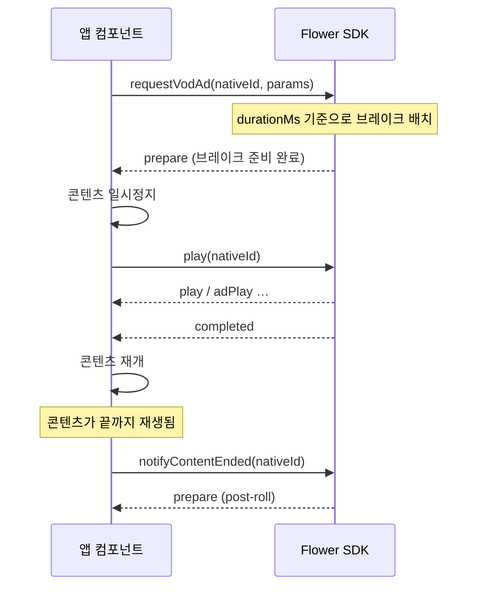

# VOD 광고 구현

VOD 광고는 `requestVodAd()`로 요청합니다. 여기서는 아무것도 재작성되지 않습니다 — 콘텐츠는 원래 URL로 계속 재생되고, 각 광고 브레이크는 `prepare` 이벤트로 전달되어 `<Video>` 위에 겹쳐진 SDK 자체 광고 플레이어에서 재생됩니다.

콘텐츠 플레이어는 여전히 앱의 것이므로, **각 브레이크 전후로 콘텐츠를 일시정지하고 재개하는 것은 앱의 책임**입니다.

## 광고 브레이크 생명주기



## 구현

```tsx
import React, {useCallback, useEffect, useRef, useState} from 'react';
import {StyleSheet, View} from 'react-native';
import Video from 'react-native-video';
import {
  addAdEventListenerFor,
  notifyContentEnded,
  play,
  release,
  requestVodAd,
} from '@anypoint/flower-sdk-react-native';

type Props = {
  nativeId: string;
  contentUrl: string;
  adTagUrl: string;
  contentId: string;
  durationMs: number;
};

export function VodPlayer({
  nativeId,
  contentUrl,
  adTagUrl,
  contentId,
  durationMs,
}: Props) {
  const [paused, setPaused] = useState(false);
  const requested = useRef(false);

  useEffect(() => {
    const subscription = addAdEventListenerFor(nativeId, event => {
      if (event.event === 'prepare') {
        // 브레이크 전후로 콘텐츠를 일시정지/재개하는 것은 앱의 역할입니다.
        setPaused(true);
        play(nativeId).catch(e => console.error(`play failed: ${e.message}`));
      } else if (event.event === 'completed') {
        setPaused(false);
      } else if (event.event === 'error') {
        // 브레이크가 실패했을 때 시청자를 멈춘 화면에 남겨두지 않습니다.
        setPaused(false);
        console.error(`ad error: ${event.message}`);
      }
    });
    return () => subscription.remove();
  }, [nativeId]);

  useEffect(
    () => () => {
      if (requested.current) {
        release(nativeId).catch(() => {});
      }
    },
    [nativeId],
  );

  // 요청 전에 플레이어가 존재해야 하므로 onLoad에서 호출합니다.
  const request = useCallback(async () => {
    if (requested.current) {
      return;
    }
    try {
      await requestVodAd(nativeId, {adTagUrl, contentId, durationMs});
      requested.current = true;
    } catch (error: any) {
      console.error(`requestVodAd failed: ${error.message}`);
    }
  }, [nativeId, adTagUrl, contentId, durationMs]);

  return (
    <View style={styles.player}>
      <Video
        nativeID={nativeId}
        // VOD에서는 콘텐츠 URL이 재작성되지 않습니다.
        source={{uri: contentUrl}}
        style={StyleSheet.absoluteFill}
        resizeMode="contain"
        paused={paused}
        onLoad={request}
        // 이 호출이 없으면 SDK는 콘텐츠 종료를 알 수 없고 post-roll도 재생되지 않습니다.
        onEnd={() =>
          notifyContentEnded(nativeId).catch(e =>
            console.error(`notifyContentEnded failed: ${e.message}`),
          )
        }
        onError={e => console.error(`player error: ${JSON.stringify(e)}`)}
      />
    </View>
  );
}

const styles = StyleSheet.create({
  player: {width: '100%', aspectRatio: 16 / 9, backgroundColor: '#000'},
});
```

:::caution
`requestVodAd()`는 `changeChannelUrl()`과 마찬가지로 플레이어가 먼저 존재해야 합니다. 마운트 시점이 아니라 `onLoad` 이후에 호출하세요. Linear TV와 달리 이후 소스 교체가 없어 `onLoad`가 한 번만 발생하므로 재진입 가드가 반드시 필요하지는 않지만, 위 예제의 ref는 컴포넌트 재마운트 상황에서 안전을 확보해 줍니다.
:::

:::caution 콘텐츠 일시정지는 `prepare`에서만, `play`에서는 하지 마세요
SDK는 광고 브레이크를 위해 별도의 플레이어를 만들지 않고, `<Video nativeID={nativeId}>`에서 인계받은 player를 재사용합니다. 위 예제처럼 `prepare` 이벤트에서 콘텐츠를 일시정지하고, `play` 이벤트에서는 player를 건드리지 마세요. 광고 재생을 의미하는 `play` 이벤트에서 player를 pause 시킬 경우 광고가 중지되게 됩니다.
:::

## Pre-roll, Mid-roll, Post-roll

브레이크 위치는 광고 응답에서 결정되며, 전달한 `durationMs`를 기준으로 배치됩니다. 따라서 이 값은 콘텐츠의 실제 총 재생 시간(밀리초)이어야 합니다.

| 브레이크 | 발생 시점 |
| ---| --- |
| Pre-roll | `requestVodAd()` 완료 직후의 `prepare` 이벤트 |
| Mid-roll | 재생 위치가 브레이크 지점에 도달했을 때의 `prepare` 이벤트 |
| Post-roll | `notifyContentEnded()` 호출 이후의 `prepare` 이벤트 |

:::caution
앱이 `notifyContentEnded(nativeId)`를 호출하지 않으면 post-roll이 재생될 수 없습니다. `<Video>` 컴포넌트의 `onEnd` prop에 연결하세요.
:::

## 타게팅과 헤더

```tsx
await requestVodAd(nativeId, {
  adTagUrl,
  contentId,
  durationMs,
  extraParams: {title: 'My Summer Vacation', genre: 'horror'},
  adTagHeaders: {'custom-ad-header': 'custom-ad-header-value'},
});
```

[extraParams 정의](../define-extra-params.md)와 [`requestVodAd` API 레퍼런스](../../api/vod.md)를 참고하세요.

## 관련 문서

*   [`requestVodAd` API 레퍼런스](../../api/vod.md)
*   [광고 이벤트](../../api/ad-event.md)
*   [연동 동작 방식](../how-the-integration-works.md)
