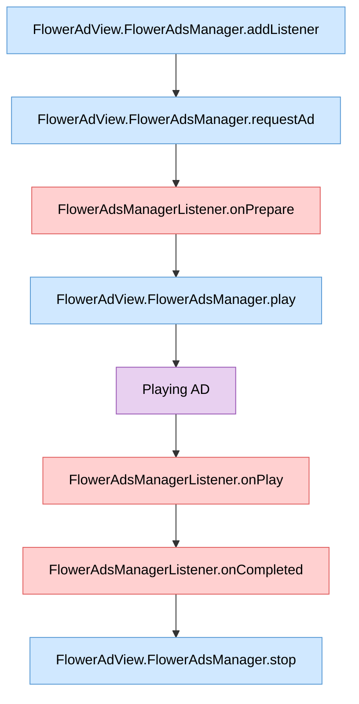

# Advanced Ad Formats

이 SDK는 메인 페이지, 화면 전환 게시물 사이 등 어느 곳에나 광고를 삽입할 수 있습니다.

## 광고 유형

### 인라인 광고
웹페이지나 앱의 콘텐츠 흐름 안에 자연스럽게 배치되는 광고입니다. 피드, 기사 본문, 리스트 사이 등에 삽입되어 사용자 경험을 크게 해치지 않으면서 노출됩니다.

### 마스트헤드 광고
페이지 최상단(헤더 영역)에 크게 노출되는 프리미엄 광고입니다. 높은 가시성을 제공하며, 포털 메인이나 앱 홈 화면 등에서 브랜드 인지도를 높이는 데 주로 사용됩니다.

### 전면(인터스티셜) 광고
화면 전체를 차지하는 광고로, 화면 전환·레벨 전환·콘텐츠 사이 등의 자연스러운 전환 시점에 표시됩니다. 높은 몰입도를 제공하며 사용자가 광고를 닫거나 일정 시간이 지나면 원래 콘텐츠로 돌아갑니다.

## 기타
어느 위치나 시점에 원하는 형태의 광고를 삽입할 수 있습니다. 자세한 사항은 계정 관리자에게 문의할 수 있습니다.

## Lifecycle

### 전면 광고 삽입

광고 이벤트 리스너를 등록하고 광고를 삽입하는 모든 과정을 표현하는 순서도입니다.

> **범례**  
>  &nbsp;앱에서 호출하는 함수
> &nbsp;SDK가 발생시키는 이벤트
