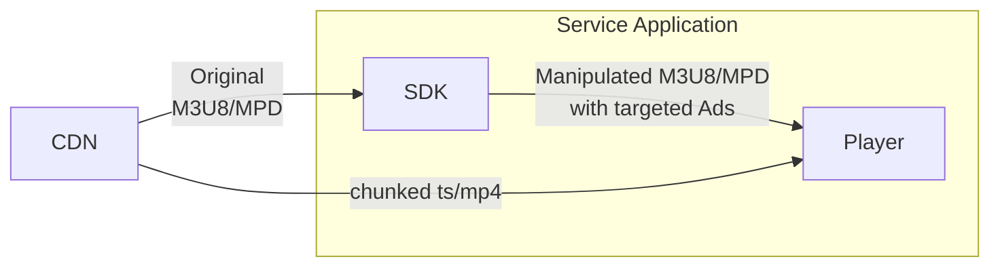
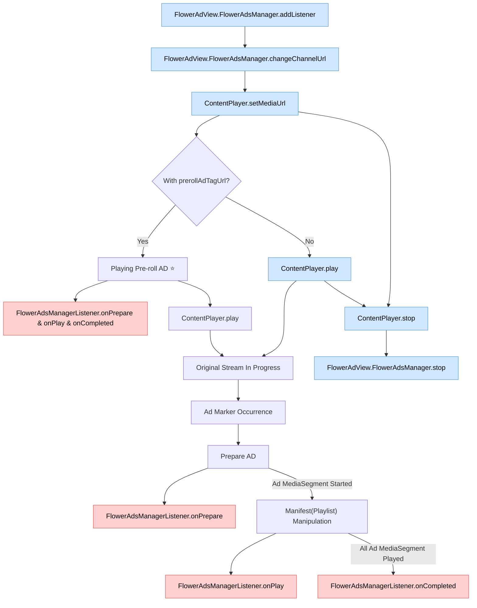

# OTT Linear TV (incl. FAST) 광고

이 SDK는 시청자가 Live HLS/DASH 콘텐츠에 진입했을 때 광고를 재생하거나, 광고 마커를 사용하여 재생목록 매니페스트(m3u8 또는 mpd)를 가공하여 광고로 대체 할 수 있습니다.

## 광고 유형

### 본 스트림 대체 광고

광고 마커(예: SCTE-35)를 사용하여 본 콘텐츠 스트림을 대체하는 광고 유형입니다. 대체 광고가 재생되거나 종료될 때 SDK는 호스트 서비스에 이벤트를 전송합니다.

### 채널 진입 광고

시청자가 본 콘텐츠 스트림에 진입하기 전에 재생되는 광고입니다. 시청자가 실시간 콘텐츠를 시청하려고 하면 먼저 진입 광고가 표시됩니다. 진입 광고가 끝나면 시청자는 본 콘텐츠 스트림으로 자연스럽게 전환됩니다.
단, 채널 진입 광고를 사용하는 경우에는 진입 광고가 끝난 후 자동으로 본 콘텐츠 스트림을 시작하기 때문에 앱에서 직접 재생을 시작할 필요가 없습니다. 오히려 직접 재생을 시작하는 경우에는 본 콘텐츠 영상이 일부 노출될 수 있어서 UX를 저하시킬 수 있습니다.

## View Layer 구조

*AdView*는 메인 플레이어가 위치한 뷰와 동일한 크기여야 하며 해당 뷰를 완전히 덮어야 합니다.

*AdView*는 기본적으로 투명하게 표시되며, 필요에 따라 "더보기"나 "건너뛰기" 버튼 또는 오버레이 광고가 표시될 수 있습니다.

## 애플리케이션 구조도

플레이어는 SDK를 통해 변경된 미디어 스트림주소를 사용하여 재생하게 되면 SDK가 본 콘텐츠를 광고로 대체하여 전달하게 됩니다. 따라서 플레이어에 특별한 다른 설정을 할 필요가 없습니다.

## Lifecycle

광고 이벤트 리스너를 등록하여 본 콘텐츠를 재생하면서 광고가 대체되는 모든 과정을 표현하는 순서도입니다.

> **범례**  
>  &nbsp;앱에서 호출하는 함수
> &nbsp;SDK가 발생시키는 이벤트
> ⭐ 선택사항
