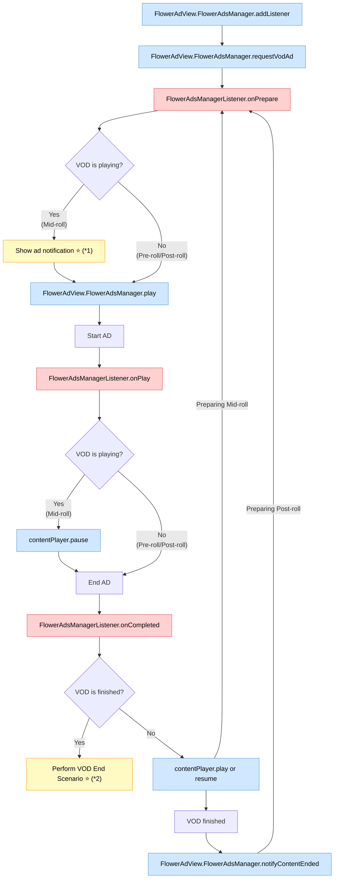

# VOD 광고

이 SDK는 사용자가 VOD 콘텐츠를 시청하는 과정에서 애플리케이션 정책에 따라 광고를 삽입할 수 있습니다.

## 광고 유형

다음 세 가지 유형의 광고를 VOD 콘텐츠에 삽입할 수 있습니다:

- **Pre-roll 광고**: 비디오 콘텐츠 시작 전에 재생되는 광고입니다.
- **Mid-roll 광고**: 비디오 스트림 도중에 재생되는 광고입니다.
- **Post-roll 광고**: 비디오 스트림 종료 후에 재생되는 광고입니다.

FLOWER는 각 유형에 대한 광고 정책을 관리하며 VMAP 형식으로 SDK에 전달합니다. 자세한 사항은 계정 관리자에게 문의할 수 있습니다.

## View Layer 구조

*AdView*는 메인 플레이어가 위치한 뷰와 동일한 크기여야 하며 해당 뷰를 완전히 덮어야 합니다.

*AdView*는 기본적으로 투명하게 표시되며, 필요에 따라 "더보기"나 "건너뛰기" 버튼 또는 오버레이 광고가 표시될 수 있습니다.

## Lifecycle

광고 이벤트 리스너를 등록하고 광고의 이벤트와 본 콘텐츠 시나리오에 따라 상호 호출하며 광고가 대체되는 모든 과정을 표현하는 순서도입니다.

> **범례**  
>  &nbsp;앱에서 호출하는 함수
> &nbsp;SDK가 발생시키는 이벤트
> ⭐ 선택사항

> (\*1) 광고 알림 표시
> - 사용자 경험을 향상시키기 위해 서비스 정책에 따라 mid-roll 광고 재생 전에 알림을 표시할 수 있습니다.
> - 예) 잠시 후 광고가 시작됩니다. 

> (\*2) VOD 종료 시나리오 수행
> - 이 SDK는 post-roll 광고가 끝난 후 VOD 재생 종료 시점에 특정 시나리오를 처리할 수 있는 방법을 제공합니다. 이를 통해 서비스 요구사항에 맞는 커스텀 동작이나 전환을 구현할 수 있습니다.
> - 예) 시리즈의 다음 에피소드 자동 재생
